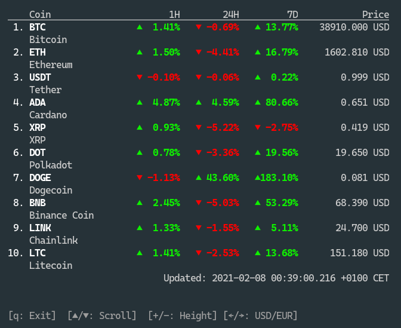

<h1 align="center">CryptoTicker</h1>

Terminal cryptocurrency tracker written in go

## About this Project

This project was created to play around and collect some experience with the [bubbletea framework](https://github.com/charmbracelet/bubbletea) for creating terminal user interfaces.
